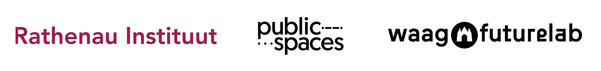

### Colofon
Dit is een document van CIIIC, in opdracht van CIIIC opgesteld door het Rathenau Instituut, Waag Futurelab en PublicSpaces. 

Versie 1.0, 10 juli 2025.

### Inhoudsopgave
| Titel                                               | Pagina |
|-----------------------------------------------------|--------|
| Handleiding             | 2      | 
| A. Richtlijn Publieke Waarden binnen Immersive Experiences    | 3      |
| B. Publieke Waarden Zelftoets | 10    |

## Handleiding

Het doel van de Publieke Waarden Zelftoets (PWZ) is het vergroten van de bewustwording rondom Publieke Waarden in het Immersive Experiences (IX)-veld, en om zoveel mogelijk schadelijke gevolgen te vermijden. Deze toets is toegespitst op gebruik bij de aanvraag- en offerteprocedures voor financiering binnen het Nationaal Groeifonds Programma Creative Industries Immersive Impact Coalition (CIIIC).

De PWZ bestaat uit twee secties. Sectie A is de Richtlijn. Dit is de inhoudelijke inleiding van de PWZ waarin de zeven waarden worden toegelicht. De richtlijn is bedoeld ter voorbereiding op sectie B. Lees deze eerst rustig door voordat je verder gaat.

Sectie B bestaat uit de Toets en heeft drie delen: deel 1 bevat de voorwaarden, deel 2 de vragen, en deel 3 de open vraag.

Sectie A is informatief en richtinggevend, bij sectie B wordt elk onderdeel op een andere manier gewogen. De voorwaarden in deel 1 dienen ondertekend te worden. Zonder deze ondertekening kan geen aanvraag of offerte worden ingediend. De vragen bij deel 2 dienen naar eer en geweten te worden beantwoord door de aanvrager/indiener. Een commissie zal van dit deel kennisnemen en de antwoorden meenemen in de weging van de aanvraag/offerte. In dit deel zijn absoluut foute antwoorden onmogelijk. De vragen zijn bedoeld om helderheid te verschaffen over mogelijke risico’s van de ervaring en inzichtelijk te maken hoe de aanvrager/indiener hiermee omgaat.

De open vraag in deel 3 biedt ruimte om in te gaan op de positieve uitwerking die het project kan hebben op een specifieke waarde. Deze vraag is optioneel, en kan worden meegenomen in de totaalweging van het project.

## A. Richtlijn Publieke Waarden binnen Immersive Experiences

Disclaimer: de technologie rondom IX verandert in razend tempo, en specificaties, hardware, software, voorwaarden en wetgeving zijn aan verandering onderhevig. Gedurende de looptijd van CIIIC is het van belang om deze ontwikkelingen te volgen en kan het nodig zijn de consequenties daarvan te vertalen in deze Richtlijn. De huidige versie kan daarmee aan verandering onderhevig zijn.

Binnen het Nationaal Groeifonds Programma Creative Industries Immersive Impact Coalition (CIIIC) staan publieke waarden centraal. De Richtlijn Publieke Waarden heeft als doel het definiëren van publieke waarden en is bedoeld voor iedereen die activiteiten ontplooit binnen Immersive Experiences: ontwikkelaars, toepassers, onderzoekers, makers en andere stakeholders. Zij worden hierna aangeduid als IX-professionals.

IX dompelen ons zintuiglijk onder in een alternatieve, digitaal gecreëerde realiteit, denk aan projecties, audioscapes, virtual reality, 360 graden beeld/video, augmented reality, chatbots, interactieve animaties en games. Binnen IX spelen Extended Reality (XR)-apparaten zoals headsets vaak een belangrijke rol. XR is de verzamelnaam voor technologieën die onze kijk op de wereld aanvullen, versterken of vervangen. Dat gebeurt door digitale informatie en grafische elementen te projecteren op de echte wereld, door puur virtuele omgevingen te creëren, of een combinatie van beide. Dit proces wordt ook wel *spatial computing* genoemd.

CIIIC verwacht dat IX grote impact zullen hebben op ons dagelijks leven, zowel qua werken, leren en recreatie, en aanjagers zullen zijn van de derde digitale transitie.

Recente ontwikkelingen op het gebied van digitale technologie bieden kansen en uitdagingen voor de realisatie van publieke waarden. Deze kansen en uitdagingen spelen ook een rol binnen IX en de daarvoor gebruikte XR-apparaten.

De kansen bestaan onder andere uit nieuwe behandelings- en onderzoeksvormen in de gezondheidszorg, inclusie van specifieke doelgroepen met fysieke beperkingen en nieuwe verschijningsvormen van kunst en storytelling. De risico’s bevinden zich onder meer op het vlak van verregaande verzameling van zeer persoonlijke data via sensoren en nieuwe vormen van desinformatie. Ook de razendsnelle ontwikkeling van AI-toepassingen en mogelijke integratie in IX, waarbij regelgeving achterblijft, heeft een grote maatschappelijke impact en verdient aandacht.

Het is evident dat binnen het zich snel ontwikkelende veld van IX, publieke waarden geborgd dienen te worden. In lijn met [het onderzoek naar immersieve technologieën van het Rathenau Instituut](https://www.rathenau.nl/sites/default/files/2024-01/%28EN%29%20Rathenau%20Instituut%20I%20Scan%20I%20Immersieve%20technologieen%20Final_LM_schoon.pdf) zijn in de Publieke Waarden Zelftoets (PWZ) de volgende zeven waarden centraal gesteld: Privacy, Zelfbeschikking, Democratie, Gezondheid, Veiligheid, Inclusiviteit/Participatie/Non-Discriminatie en Duurzaamheid. Deze zeven waarden worden hieronder beschreven, met per waarde aanbevelingen over hoe deze binnen de context van IX zo goed mogelijk kan worden geborgd.

Wat de beste manier vormt voor de realisatie hiervan is nog onderwerp van onderzoek. De PWZ is hierin een eerste stap, bedoeld om de grootste risico’s voor de gebruiker te verminderen, en om het gesprek rondom publieke waarden en technologie op te starten.

De uitgangspunten van de Richtlijn zijn dat de gebruiker van IX geen schade wordt berokkend, dat eventuele financiële belangen binnen de productie duidelijk kenbaar worden gemaakt en dat er sprake is van zakelijke transparantie volgens de relevante *good governance*-kaders waarbinnen de IX-professional opereert.

Bij toepassing van de Richtlijn gelden mogelijk andere maatstaven binnen de context van satire of artistieke en creatieve uitingen, mits overtuigend inhoudelijk gemotiveerd.

### 1. Privacy

XR-apparaten zijn ten behoeve van hun functioneren uitgerust met een (groot) aantal sensoren die gegevens over locatie, omgeving en beweging kunnen vastleggen. Ook is het mogelijk dat XR-apparaten gezondheids- en biometrische gegevens vastleggen (oogbewegingen, pupilreflexen, hartslag, ademhaling et cetera). Tenslotte kunnen bij specifieke toepassingen diverse data worden verzameld over het gebruik van de toepassing en de gebruiker zelf (zoals bijvoorbeeld accountgegevens en voorkeuren).

De IX-professional dient zich bewust te zijn van de privacygevoeligheid van deze gegevens en er op een zorgvuldige en rechtmatige wijze mee om te springen. Meer specifiek betreft het de volgende privacygevoelige aspecten:

- Op de eerste plaats zijn dat de gegevens van gebruikers die de aanbieder zelf verzamelt om de toepassing te laten functioneren.  
- Ten tweede zijn dat de gebruikersgegevens die worden verzameld door de fabrikanten/aanbieders van de XR (hardware)-platformen waar de toepassing gebruik van maakt. Dataverzameling is enerzijds nodig voor het laten functioneren van het product, maar is daarnaast voor sommige hardware-aanbieders een essentieel onderdeel van het verdienmodel.  
- Ten derde gaat het om de verzameling van gegevens van omstanders via de sensoren op de apparaten, die daar geen toestemming voor hebben verleend. Omwille van de privacy van omstanders is het belangrijk om terughoudendheid te betrachten bij de verzameling.

Voor de rechtmatige verwerking van persoonsgegevens vormt de Algemene Verordening Gegevensbescherming (AVG) het belangrijkste kader. De AVG stelt de volgende eisen aan de verwerking van persoonsgegevens binnen IX-toepassingen:

1. De toepassing is rechtmatig (heeft een duidelijk doel met een wettelijke grondslag).  
2. De toepassing is transparant (de betrokkene wordt geïnformeerd).  
3. De gegevens worden niet voor andere doeleinden gebruikt (doelbinding).  
4. Enkel noodzakelijke gegevens worden verwerkt (dataminimalisatie).  
5. De gegevens worden niet langer bewaard dan noodzakelijk (opslagbeperking).  
6. De gegevens worden goed beveiligd.

De IX-professional dient allereerst te zorgen dat de eigen verwerkingen binnen de IX voldoen aan deze vereisten. Hierbij gaat het niet alleen om de privacy van de gebruikers van de toepassing, maar ook om die van omstanders.

Om het privacy-risico van de gegevensverzameling door aanbieders en fabrikanten van IX-hardware en platformen te verkleinen, is het belangrijk dat IX-professionals doen wat er in hun invloedssfeer mogelijk is om data-acquisitie en opslag te beperken. Dit kan bijvoorbeeld door het minimaliseren van dataverzameling, het inzetten van lokaal gehoste servers, en het anonimiseren van persoonsgegevens.

Ook de keuze voor specifieke hardware kan hierin verschil maken. Zo kunnen privacyvoorwaarden - en de mogelijkheid tot bepaling hiervan - tussen diverse aanbieders worden vergeleken. Wordt hardware en/of software van derden gebruikt, dan dienen duidelijke afspraken te zijn over de gegevensverwerking, bijvoorbeeld middels een (verwerkers)overeenkomst.

Ten slotte is het van belang dat de gebruiker van de IX in eenvoudige en heldere taal wordt geïnformeerd over welke data worden verzameld en met welk doel, waar en hoe lang de data worden opgeslagen en welke partijen daar toegang tot hebben. Wanneer deze informatie (gedeeltelijk) onbekend is, dient de gebruiker daar ook van op de hoogte te worden gesteld.

Door het volgen van deze richtlijn committeert de IX-professional zich aan de vereisten van de AVG voor wat betreft de eigen invloedssfeer.

### 2. Zelfbeschikking

Het intieme karakter en de fysieke nabijheid van IX en de wisselwerking tussen technologieën zoals AI, VR en neurotechnologie, maakt beïnvloeden van emoties en gedrag door misleiding mogelijk. Hiermee komt de zelfbeschikking onder druk te staan.

Een voorbeeld hiervan zijn zogenoemde *deceptive patterns* (ook wel *dark patterns* genoemd). Deze termen refereren aan interfaces, gebruikerstrajecten of visuele of taalkundige elementen die de gebruiker ertoe bewegen of verleiden onbedoelde, onbewuste of potentieel nadelige beslissingen te nemen op het gebied van gegevensbescherming of het doen van aankopen.

Andere voorbeelden van opzettelijk misleiding of manipulatie zijn sluikreclame en brand placement die gebruikers van de IX naar specifieke fysieke locaties sturen, en synthetische avatars die zich voordoen als mensen van vlees en bloed.

Door het volgen van deze richtlijn committeert de IX-professional zich aan het vermijden van oneerlijke handelspraktijken, misleiding en volgt hij of zij — in het geval van reclame — de regels van de [Nederlandse Reclamecode](https://www.reclamecode.nl/).

### 3. Democratie

Democratische besluitvorming is gebaat bij consensus over een gezamenlijke en evenwichtige feitenbasis. Deze komt onder druk te staan door verschillende maatschappelijke factoren. IX kunnen de grenzen tussen de fysieke en digitale wereld vervagen. Daarnaast kan de vermenging van technieken als XR, neurotechnologie en AI resulteren in een vergaande gepersonaliseerde virtuele omgeving, een fenomeen dat ook wel *hyper-personalisatie* genoemd.

De marktdominantie van een beperkt aantal grote techbedrijven uit de VS en China is in de XR-sector een zorg, te meer daar ze ook in het publieke domein — waaronder onderwijs, zorg en journalistiek — essentiële diensten (gaan) leveren. Dit betreft een Europees probleem dat niet enkel met deze richtlijn opgelost kan worden. Dat neemt niet weg dat bewustzijn hieromtrent essentieel is. Om democratische stuurkracht te behouden, is het van belang oog te hebben voor (open source) alternatieven en zoveel mogelijk autonomie voor de gebruiker in te bouwen. Een manier om machtsconcentratie tegen te gaan, is het gebruik van standaardisatie, zie ook [Web 4.0 and virtual worlds (RP 2024)](https://interoperable-europe.ec.europa.eu/collection/rolling-plan-ict-standardisation/web-40-and-virtual-worlds-rp-2024). Deze standaarden dragen bij aan leveranciersonafhankelijkheid, controle over informatie en betere gegevensuitwisseling tussen platforms en netwerken, ook wel *interoperabiliteit* genoemd. Verder moet worden gekeken in hoeverre het mogelijk is om bij inzet van technologieën te kiezen voor Europese aanbieders (de *EuroStack*).

Door het volgen van deze richtlijn committeert de IX-professional zich aan een integere omgang met de waarnemingsverstorende effecten van IX, terughoudendheid in de inzet van dergelijke effecten in de publieke ruimte, en bij het nemen van maatregelen om nadelige effecten — effecten die niet het directe doel van de ervaring dienen — te mitigeren. Daarnaast verkent de IX-professional de mogelijkheid om de ervaringen beschikbaar te maken op devices van verschillende aanbieders. Waar mogelijk hebben open Europese standaarden, producten en diensten de voorkeur.

### 4. Gezondheid

IX kunnen zowel een positieve als negatieve impact hebben op de gezondheid van gebruikers.

Potentiële positieve gezondheidseffecten binnen IX zijn te vinden in bijvoorbeeld therapeutische toepassingen binnen de geestelijke gezondheidszorg, of in situaties waarbij IX als hulpmiddel bij trainingen wordt ingezet, zoals bij militaire operaties of medische ingrepen.

Bij overmatig gebruik van IX kan er ongewenste impact zijn op fysiek of mentaal vlak, zoals verslaving of een vertekend zelfbeeld. Andere effecten die mogelijk kunnen optreden zijn *cybersickness*, oogschade, slaapproblemen, depersonalisatie (vervreemding van het eigen lichaam en gedachten waaronder *body dysmorphia*) en derealisatie (het ervaren van de vertrouwde omgeving als onecht).

Verslavende elementen — van oorsprong ontstaan binnen sociale media en games — duiken ook op binnen IX, zoals de *endless scroll*, de *like-button*, *loot boxen*, in-game-aankopen en het aanbieden van beloningen.

Door het volgen van deze richtlijn committeert de IX-professional zich aan een bewuste omgang wat het gebruik van verslavende elementen betreft, het minimaliseren van gezondheidsrisico’s en het waarschuwen voor dergelijke risico’s voor bepaalde groepen gebruikers. Wanneer de IX-toepassing wordt ingezet als medisch hulpmiddel of als middel voor medische diagnostiek, controleert de IX-professional in hoeverre deze toepassing onder de wetgeving voor medische hulpmiddelen valt.

### 5. Veiligheid

Steeds meer mensen ervaren de digitale werkelijkheid als even echt als de fysieke. Mede daardoor wordt de veiligheid van gebruikers binnen IX steeds belangrijker.

Onveilige situaties kunnen ontstaan door (seksuele) intimidatie of aantasting van de persoonlijke ruimte binnen de digitale ervaring. Dit kan ondervangen worden door maatregelen zoals een gedragsrichtlijn die bijvoorbeeld consent (wederzijdse instemming) voorschrijft of het inbouwen van een noodknop.

Indien IX zich deels afspelen in de fysieke wereld waarbij de gebruiker autonoom dient te opereren, kan de lichamelijke veiligheid door afleiding in het geding komen.

Door het volgen van deze richtlijn committeert de IX-professional zich aan het voorkomen van fysieke en mentale schade.

### 6. Inclusiviteit, participatie, non-discriminatie

Binnen een steeds verder digitaliserende samenleving is het van belang oog te hebben voor de toegankelijkheid van digitale middelen. Dit geldt ook voor IX. De soms hoge aanschafkosten van XR-apparatuur maakt het gebruik inkomensafhankelijk.

Naast economische ongelijkheid zijn er andere vormen van ongelijkheid. Hoe toegankelijk is de IX bijvoorbeeld voor mensen met een taalbarrière of gezichtsbeperking? Ook is het van belang om niet alleen over de diversiteit van de doelgroep na te denken, maar ook hoe diversiteit gewaarborgd is binnen de teams van makers. De ontwikkelaar dient zich hiervan bewust te zijn én zich in te spannen voor een brede toegankelijkheid.

Omdat effecten en ervaringen van IX kunnen variëren in bijvoorbeeld leeftijd, gender of fysieke gesteldheid, is het ook binnen het ontwikkelproces van IX van belang om zo inclusief mogelijk te ontwerpen en te testen. Dit niet alleen binnen de gekozen doelgroep, maar ook met groepen die minder raakvlakken hebben met het ontwikkelteam.

Tegelijkertijd bieden IX de mogelijkheid om inclusiviteit en participatie juist te bevorderen, bijvoorbeeld via digitale deelname aan conferenties of gesprekken, waardoor reiskosten of fysieke belemmeringen geen belemmerende factor zijn.

Door het volgen van deze richtlijn committeert de IX-professional zich aan het actief realiseren van inclusiviteit binnen de gekozen doelgroep, en aan een ontwerp om inclusiviteit, participatie en non-discriminatie te bevorderen.

### 7. Duurzaamheid

XR-technologie met bijbehorend gebruik van AI en dataverzameling en -verwerking gebruikt veel energie. Daarmee vormt het een risico voor een duurzame samenleving. Ook maakt de hardware gebruik van kostbare en zeldzame grondstoffen en heeft apparatuur door snelle innovaties een beperkte levensduur. Recycling van grondstoffen binnen de XR-industrie staat nog in de kinderschoenen. Zo is het gebruik van zeldzame aardmetalen in hardware een uitdaging, bij gebrek aan voldoende recyclingsystemen in de XR-industrie.

Hier staat tegenover dat IX mogelijk reisbewegingen en materiaalgebruik kunnen beperken en zo CO2-reductie realiseren.

Door het volgen van deze richtlijn committeert de IX-professional zich aan de inspanning aan het onderzoek en waar mogelijk implementatie van reguliere, vernieuwende of creatieve manieren van omgang met e-waste of andere energiebesparende maatregelen en/of materialen.

## B. Publieke Waarden Zelftoets

De Richtlijn Publieke Waarden binnen Immersive Experiences (IX) wordt in de praktijk gebracht door middel van de Publieke Waarden Zelftoets (PWZ). Deze toets bestaat uit drie delen en heeft tot doel het onderzoek naar, en het borgen en operationaliseren van publieke waarden binnen de Creative Industries Immersive Impact Coalition (CIIIC)-programma’s te stimuleren.

*Deel 1* bestaat uit een aantal voorwaarden die onderschreven dienen te worden en maken onderdeel uit van de ontvankelijkheidstoets.

In *deel 2* moet per waarde een aantal vragen worden beantwoord. Hierbij zijn er geen goede of foute antwoorden mogelijk: het is met name van belang dat er bewuste keuzes gemaakt worden ten aanzien van publieke waarden, en dat deze worden toegelicht.

In *deel 3* wordt de aanvrager/indiener uitgenodigd één waarde in de context van het project verder toe te lichten, waarbij met name de potentiële positieve impact ruimte krijgt. Hiervoor kan een bijlage worden opgesteld van maximaal één pagina.

### Deel 1

Hierbij verklaar ik dat binnen dit project:

- Het sector-relevante good governance-kader wordt toegepast;
- Er geen misleidende of manipulatieve content en toepassingen worden ontwikkeld;
- De (mentale) gezondheid en veiligheid van de gebruiker niet opzettelijk in gevaar zal worden gebracht;
- De verzamelde persoonsgegevens in lijn met de AVG en aanverwante privacywetgeving worden verwerkt en niet worden verkocht aan derden of anderszins worden ingezet voor andere doeleinden dan die van het project of de ervaring zelf;
- Inspanning wordt geleverd om te onderzoeken hoe derden (zoals hardware- of software-aanbieders) omgaan met vergaarde data van gebruikers en omstanders en of daar in transparante en heldere taal over wordt gecommuniceerd;
- Schriftelijke afspraken worden/zijn gemaakt met andere partijen die ten behoeve van mijn toepassing gegevens verwerken (verwerkersovereenkomst).

### Deel 2

#### 0. Doel

0.1 Wat is het doel van de ervaring, en wat is de beoogde doelgroep?

#### 1. Privacy

1.1 Bij IX worden vaak data gegenereerd en opgeslagen door diverse partijen. Deze data kunnen een risico zijn voor de privacy van de gebruiker, en de gebruiker mogelijk identificeerbaar maken.

1. Welke data worden verzameld, met welk doel en voor welke periode, waar worden ze opgeslagen, en met wie worden ze gedeeld?
2. Welke inspanningen heb je gedaan om dataverzameling te minimaliseren?
3. Welke inspanningen heb je gedaan om de gegevens te beveiligen?
4. Hoe wordt dit gecommuniceerd met de gebruiker en eventuele omstanders?
5. Als je op onderdelen niet kan achterhalen wat er met de data gebeurt, hoe schep je hier duidelijkheid over richting gebruiker en omstanders?

#### 2. Zelfbeschikking

2.1 IX kunnen de zelfbeschikking van gebruikers onder druk zetten door het sturen van gedrag ten gunste van derden, vaak met een commercieel motief. Betrokkenen met financiële, politieke of andere belangen moeten goed zichtbaar worden vermeld.

- Wie zijn de betrokkenen bij de ontwikkeling van IX en wat is hun belang?
- Hoe wordt bovenstaande op een begrijpelijke manier gecommuniceerd met de gebruiker?

#### 3. Democratie
3.1 Opzettelijke misleiding en manipulatie met behulp van IX kan afbreuk doen aan de democratie. Kan de ervaring worden misbruikt voor het verspreiden van mis- en desinformatie?

O ja
O nee

Bij ja:
<ol>
<li>Omschrijf hoe je dit op een begrijpelijke manier communiceert aan de gebruiker;</li>
<li>Omschrijf hoe je deze risico’s minimaliseert en mitigeert.</li>
</ol>

3.2 Wordt er gebruik gemaakt van deep fakes of door AI gegenereerde content?

  O ja
  O nee

Bij ja:
  <ul>
    <li>Hoe wordt dit op een begrijpelijke manier gecommuniceerd aan de gebruiker?</li>
  </ul>

---

3.3 Wordt de ervaring ingezet in de openbare en fysieke ruimte, waarbij deze ruimte visueel of auditief onderdeel uitmaakt van de ervaring?

  O ja
  O nee

Bij ja:
  <ul>
    <li>Hoe communiceer je aan omstanders en andere gebruikers van deze openbare fysieke ruimte dat deze onderdeel zijn van IX?</li>
  </ul>

---

3.4 Diversiteit in hardware en software draagt bij aan digitale autonomie. Het werken met open source hard- en software en open Europese standaarden kan daar invulling aan geven.

- Welke hardware wordt gebruikt, en wat zijn de overwegingen?
- Wordt er gebruik gemaakt van (Europese) open standaarden? Zo ja welke? Zo nee, waarom niet?
- Wat doe je om zoveel mogelijk open source software te gebruiken?

---

#### 4. Gezondheid

4.1 IX kunnen heftige emotionele en/of fysieke reacties oproepen. Het is daarom belangrijk om de gebruiker te adviseren over verantwoorde schermtijd en duur van de ervaring, eventuele on- en off boarding te bieden en waar nodig leeftijdsgebonden toegangseisen te stellen.

- Hoe houd je rekening met de gezondheid van de gebruiker?
- Hoe wordt dit gecommuniceerd?

4.2 De ervaring moet worden getest binnen de beoogde doelgroep om gezondheidsproblemen zoals bijvoorbeeld *cybersickness* te voorkomen.

- Op welke manier worden de ervaringen getest?

#### 5. Veiligheid

5.1 Als er binnen de ervaring directe of indirecte interactie tussen gebruikers plaatsvindt, kan dit tot ongewenste of onveilige situaties voor de gebruikers leiden. Is er sprake van interactie tussen gebruikers?

  O ja
  O nee

Bij ja:
  <ul>
    <li>Omschrijf hoe je mogelijke risico’s minimaliseert en mitigeert;</li>
    <li>Hoe worden deze risico’s gecommuniceerd met de gebruiker?</li>
    <li>Wat is het beleid rondom moderatie en identificatie?</li>
  </ul>

---

5.2 Indien IX zich deels afspelen in de fysieke wereld waarbij de gebruiker autonoom dient te opereren, kan door afleiding de lichamelijke veiligheid in gevaar komen. Speelt de ervaring zich (deels) af in de fysieke wereld?

  O ja
  O nee

Bij ja:
  <ul>
    <li>Omschrijf hoe je mogelijke risico’s minimaliseert en mitigeert;</li>
    <li>Hoe worden deze risico’s gecommuniceerd met de gebruiker?</li>
  </ul>

#### 6. Inclusiviteit, participatie, non-discriminatie

6.1 IX moeten zo inclusief mogelijk worden ontworpen, waarbij binnen de doelgroep ruimte wordt gecreëerd voor diversiteit.

- Welke inspanningen worden geleverd om — binnen de gekozen doelgroep — de ervaring op inclusieve wijze te ontwikkelen, bijvoorbeeld door het betrekken van mensen met auditieve, visuele, cognitieve beperkingen; het betrekken van kwetsbare groepen of minderheidsperspectieven?
- Hoe wordt omgegaan met inclusiviteit binnen het team van makers, al dan niet in relatie tot de doelgroep en het doel van de ervaring?

---

#### 7. Duurzaamheid

7.1 IX kunnen een extra belasting zijn voor het milieu. Dit geldt zowel voor het gebruik van energie als materialen.

- Welke energiebesparende maatregelen zijn er getroffen?
- Is het hergebruik van materiaal overwogen en wat is hiervan het resultaat?

### Deel 3

In deel 2 van de PWZ richten we ons met name op de mogelijke negatieve effecten van IX. In dit deel 3 is ruimte voor de positieve impact op publieke waarden. Kies één van de waarden (privacy, zelfbeschikking, democratie, gezondheid, veiligheid, inclusiviteit/participatie/non-discriminatie, of duurzaamheid) en licht toe hoe de aanvraag/offerte positief tegemoetkomt of bijdraagt aan deze waarde.

**Lengte:** maximaal 1 pagina.

